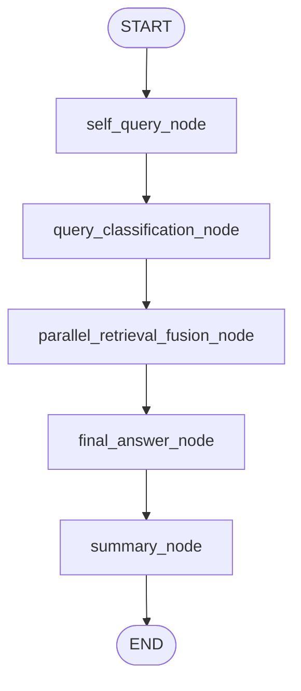
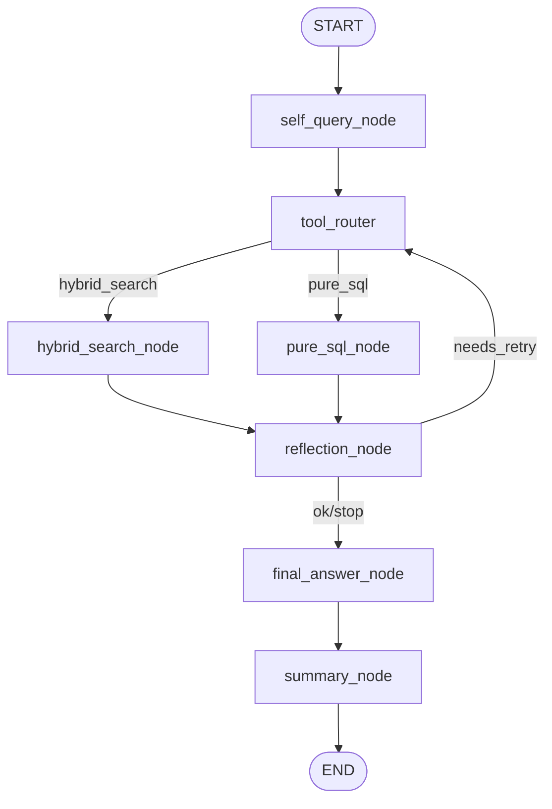

# System Architecture

## Default Runtime Graph

The default runtime graph is `parallel_fusion`.

## Legacy Fallback Graph

`legacy_router` is still available as a fallback mode and is enabled only when
`AGENT_EXECUTION_MODE=legacy_router`.

## Key Responsibilities

- `self_query_node`
  - normalizes raw input
  - extracts user need
  - produces a conservative rewritten query
- `query_classification_node`
  - outputs `structured / semantic / mixed`
  - drives fusion weight bias instead of hard single-path routing
- `parallel_retrieval_fusion_node`
  - executes `pure_sql` and `hybrid` in parallel
  - handles timeout / degradation / fallback
  - fuses candidates with Weighted RRF
- `final_answer_node`
  - produces a grounded draft answer from retrieved rows
- `summary_node`
  - rewrites the draft into concise native-sounding English
  - appends minimal citations for auditability

## Runtime Notes

- The default architecture is no longer "pick one route then search".
- The effective production path is "self-query -> classify -> dual retrieval -> fusion -> answer -> summary".
- `legacy_router` remains useful for fallback, debugging, and regression comparison.
