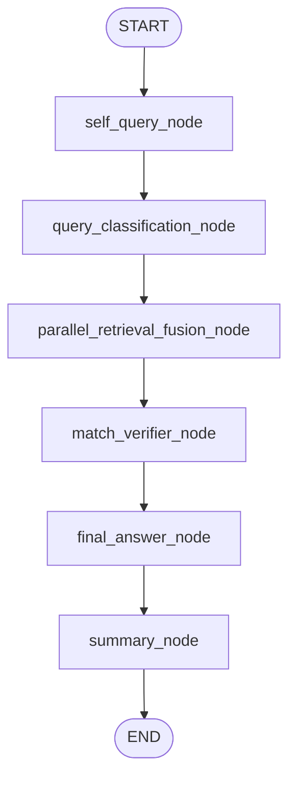

# System Architecture

## Runtime Graph

The runtime graph is `parallel_fusion` (the only mode after the
P1-5 / P3-3 cleanup on 2026-05-02; the previous `legacy_router`
fallback was removed once the parallel-fusion path stabilised).

`match_verifier_node` can be skipped via `AGENT_DISABLE_VERIFIER_NODE=1`,
in which case `parallel_retrieval_fusion_node` connects directly to
`final_answer_node`.

## Key Responsibilities

- `self_query_node`
  - normalizes raw input
  - extracts user need
  - produces a conservative rewritten query
- `query_classification_node`
  - outputs `structured / semantic / mixed`
  - drives fusion weight bias instead of hard single-path routing
- `parallel_retrieval_fusion_node`
  - executes `pure_sql` and `hybrid` in parallel
  - handles timeout / degradation / fallback
  - fuses candidates with Weighted RRF
- `match_verifier_node` (advisory by default)
  - decides exact / partial / mismatch verdict for `answer_type=existence`
  - other answer types are pass-through
- `final_answer_node`
  - produces a grounded draft answer from retrieved rows
  - upgrades to a Yes / Likely-yes / No answer when
    `AGENT_ENABLE_EXISTENCE_GROUNDER=1`
- `summary_node`
  - rewrites the draft into concise native-sounding English
  - appends minimal citations for auditability

## Runtime Notes

- The default architecture is no longer "pick one route then search".
- The effective production path is
  "self-query -> classify -> dual retrieval -> fusion (-> verifier) -> answer -> summary".
- The previous `AGENT_EXECUTION_MODE=legacy_router` fallback path
  (`tool_router_node` / `reflection_node` / `cot_engine` /
  `router_prompts`) is no longer available; `pure_sql_node` and
  `hybrid_search_node` are still defined under `agents/` but are not
  wired into the default graph.
