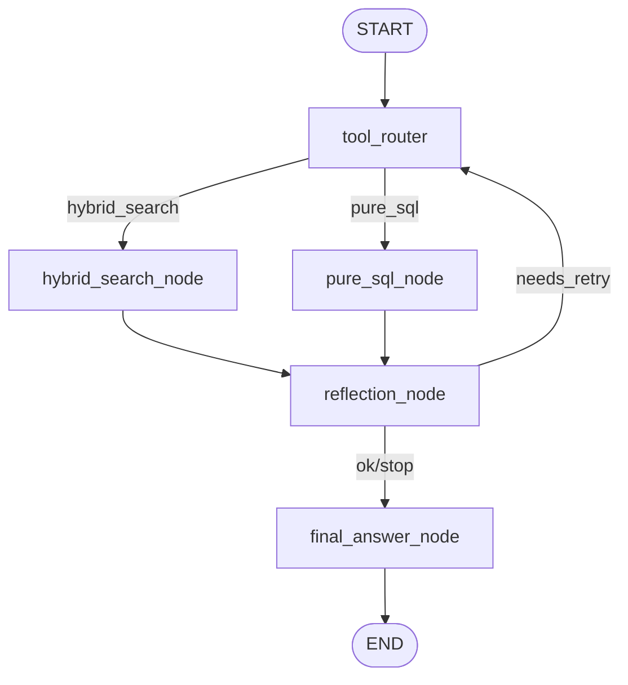

# System Architecture (Updated)

## Current Flow

## Removed Modules

- Removed from active graph:
  - `parallel_search_node`
  - `video_vect_node`
- Removed from active routing targets:
  - `mode=parallel`
  - `mode=video_vect`
- Deprecated source files renamed with `#` prefix per repository rule:
  - `agent/node/#parallel_search_node.deprecated`
  - `agent/node/#video_vect_node.deprecated`

## Notes

- Runtime-only valid route modes are now `hybrid_search` and `pure_sql`.
- Reflection phase includes mandatory route-rule validity validation before final decision.
