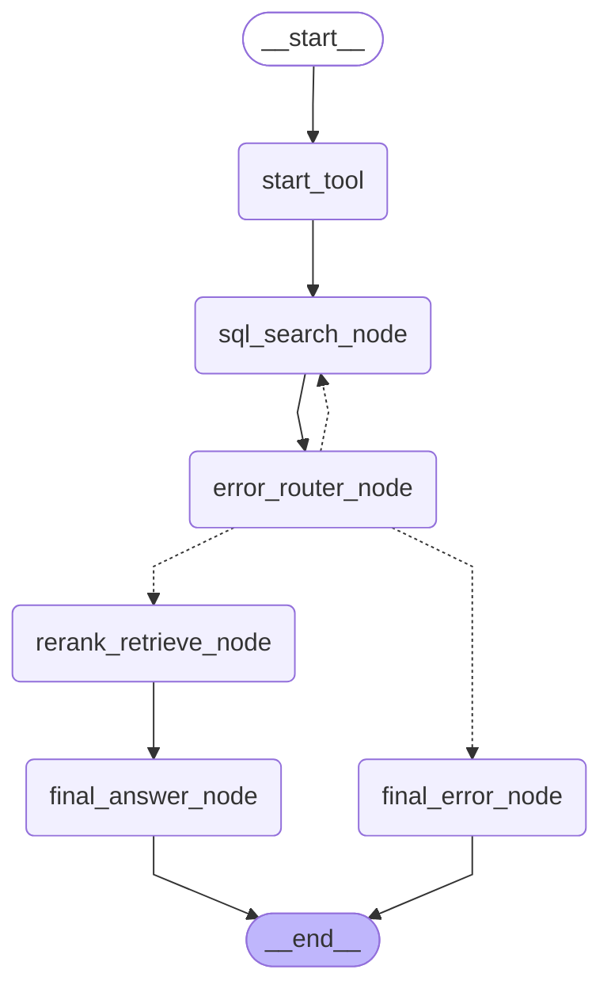

# Graph Structure

```mermaid
---
config:
  flowchart:
    curve: linear
---
graph TD;
	__start__([<p>__start__</p>]):::first
	start_tool(start_tool)
	sql_search_node(sql_search_node)
	rerank_retrieve_node(rerank_retrieve_node)
	error_router_node(error_router_node)
	final_answer_node(final_answer_node)
	final_error_node(final_error_node)
	__end__([<p>__end__</p>]):::last
	__start__ --> start_tool;
	error_router_node -.-> final_error_node;
	error_router_node -.-> rerank_retrieve_node;
	error_router_node -.-> sql_search_node;
	rerank_retrieve_node --> final_answer_node;
	sql_search_node --> error_router_node;
	start_tool --> sql_search_node;
	final_answer_node --> __end__;
	final_error_node --> __end__;
	classDef default fill:#f2f0ff,line-height:1.2
	classDef first fill-opacity:0
	classDef last fill:#bfb6fc

```
