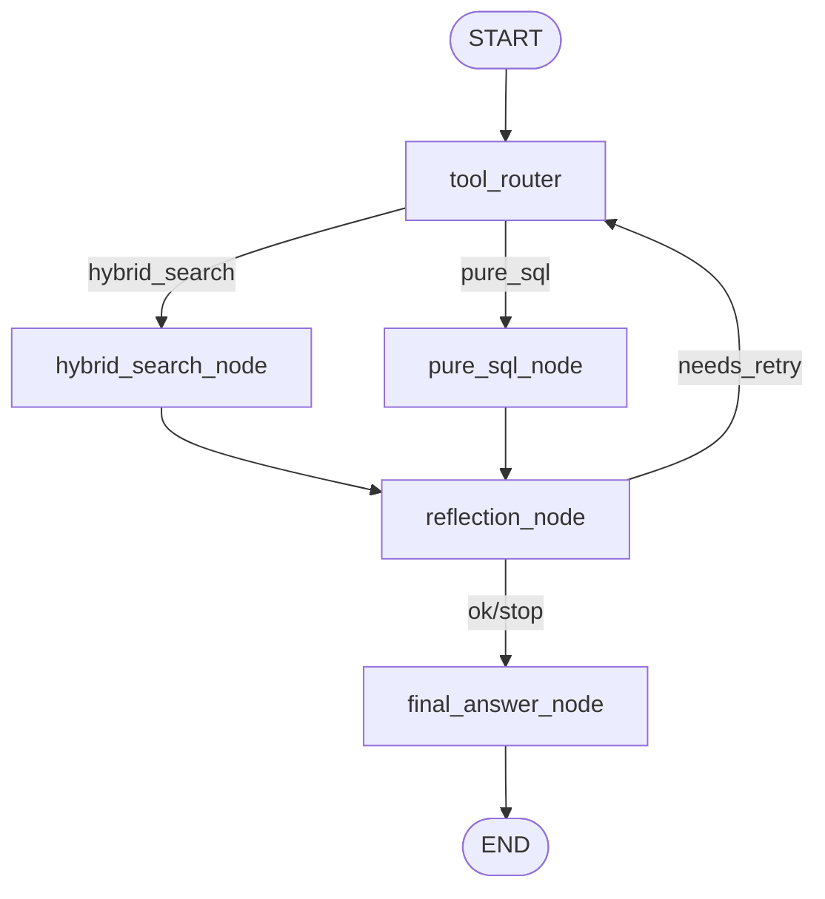

# Graph Structure (Current)

```mermaid
graph TD
    START([START]) --> tool_router
    tool_router -->|hybrid_search| hybrid_search_node
    tool_router -->|pure_sql| pure_sql_node
    hybrid_search_node --> reflection_node
    pure_sql_node --> reflection_node
    reflection_node -->|needs_retry| tool_router
    reflection_node -->|ok/stop| final_answer_node
    final_answer_node --> END([END])
```

## Removed From Active Graph

- `parallel_search_node`
- `video_vect_node`
- preprocess chain (`hybrid_preprocess/pure_sql_preprocess/video_vect_preprocess`)
