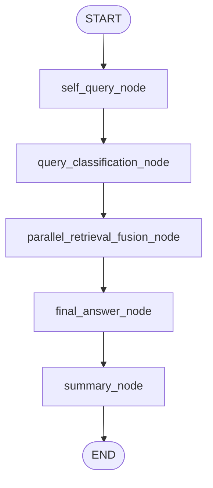
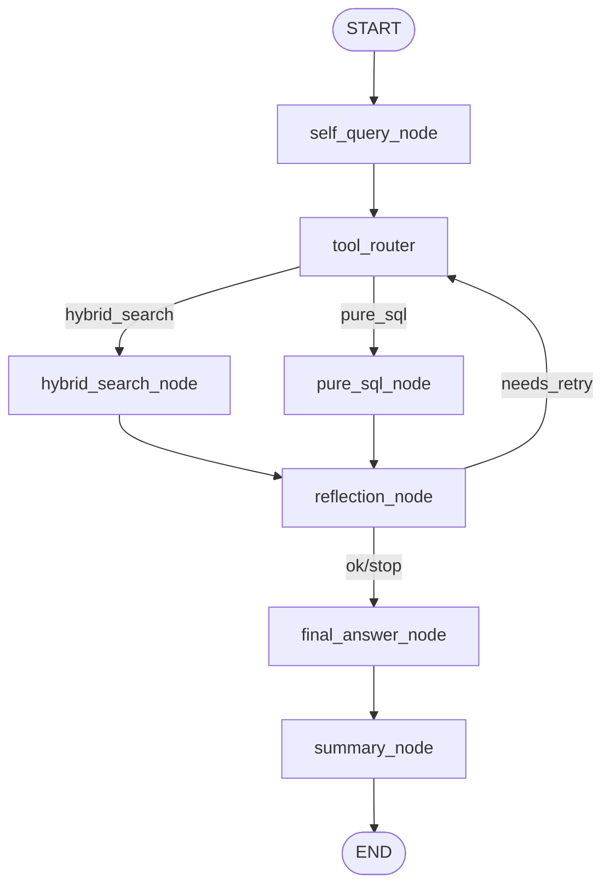

# Graph Structure

## Default Graph: `parallel_fusion`

## Fallback Graph: `legacy_router`

## Structural Notes

- `self_query_node` is inserted before all retrieval paths.
- `summary_node` is inserted after `final_answer_node`.
- The default path does not perform hard single-route branching.
- The default path always executes dual retrieval and lets fusion absorb label bias.
