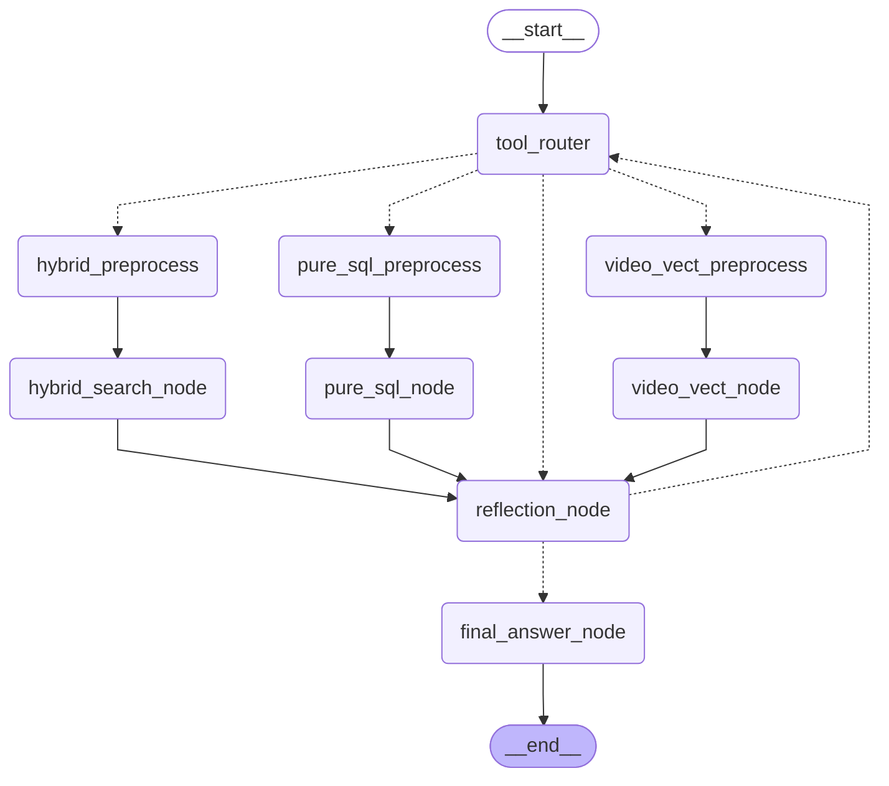

# Graph Structure

```mermaid
---
config:
  flowchart:
    curve: linear
---
graph TD;
	__start__([<p>__start__</p>]):::first
	tool_router(tool_router)
	hybrid_preprocess(hybrid_preprocess)
	pure_sql_preprocess(pure_sql_preprocess)
	video_vect_preprocess(video_vect_preprocess)
	hybrid_search_node(hybrid_search_node)
	pure_sql_node(pure_sql_node)
	video_vect_node(video_vect_node)
	reflection_node(reflection_node)
	final_answer_node(final_answer_node)
	__end__([<p>__end__</p>]):::last
	__start__ --> tool_router;
	hybrid_preprocess --> hybrid_search_node;
	hybrid_search_node --> reflection_node;
	pure_sql_node --> reflection_node;
	pure_sql_preprocess --> pure_sql_node;
	reflection_node -.-> final_answer_node;
	reflection_node -.-> tool_router;
	tool_router -.-> hybrid_preprocess;
	tool_router -.-> pure_sql_preprocess;
	tool_router -.-> reflection_node;
	tool_router -.-> video_vect_preprocess;
	video_vect_node --> reflection_node;
	video_vect_preprocess --> video_vect_node;
	final_answer_node --> __end__;
	classDef default fill:#f2f0ff,line-height:1.2
	classDef first fill-opacity:0
	classDef last fill:#bfb6fc

```

