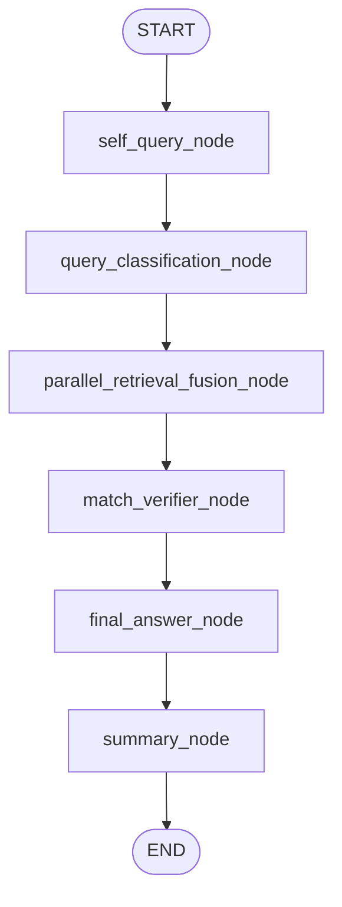

# Graph Structure

## Runtime Graph: `parallel_fusion`

`match_verifier_node` is advisory by default and can be skipped via
`AGENT_DISABLE_VERIFIER_NODE=1`, in which case the edge from
`parallel_retrieval_fusion_node` goes straight to
`final_answer_node`.

## Structural Notes

- `self_query_node` is inserted before all retrieval paths.
- `summary_node` is inserted after `final_answer_node`.
- The graph does not perform hard single-route branching.
- It always executes dual retrieval and lets fusion absorb label bias.
- The previous `legacy_router` graph (`tool_router` /
  `reflection_node` / `cot_engine` / `router_prompts`) was removed
  in P1-5 / P3-3 (2026-05-02). `pure_sql_node` and
  `hybrid_search_node` still exist under `agents/` but are no longer
  wired in here.
