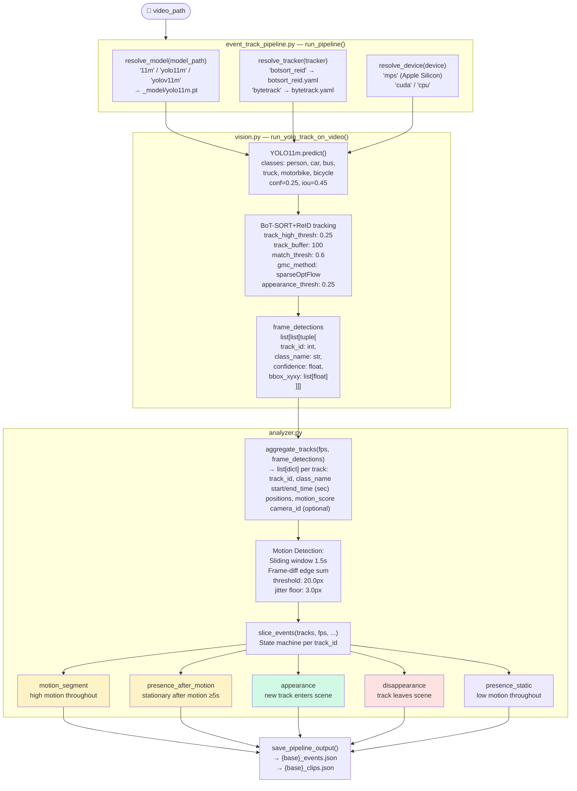
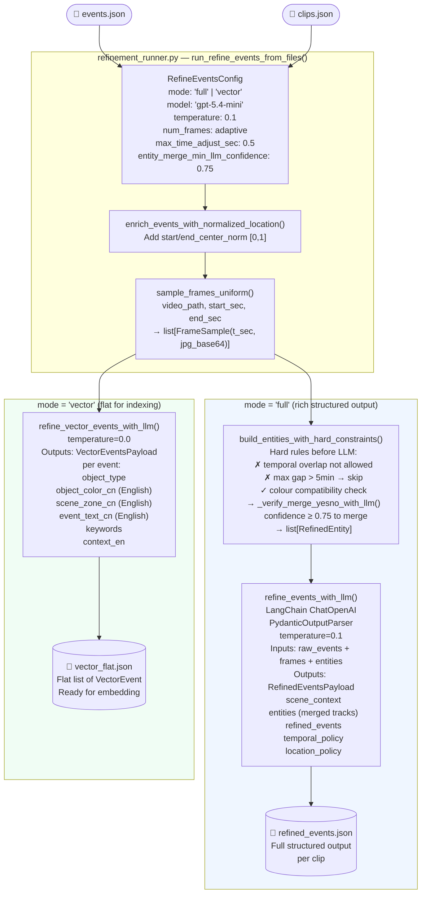
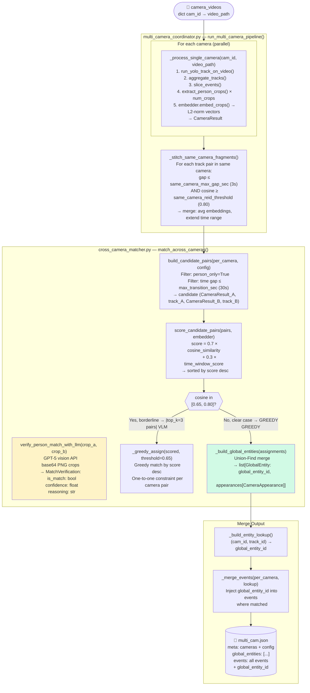
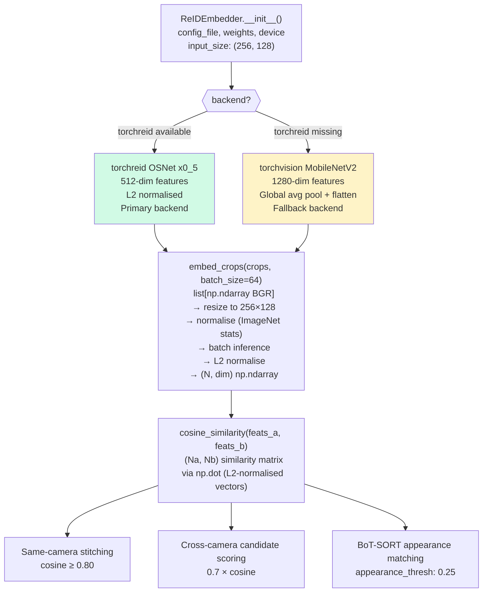
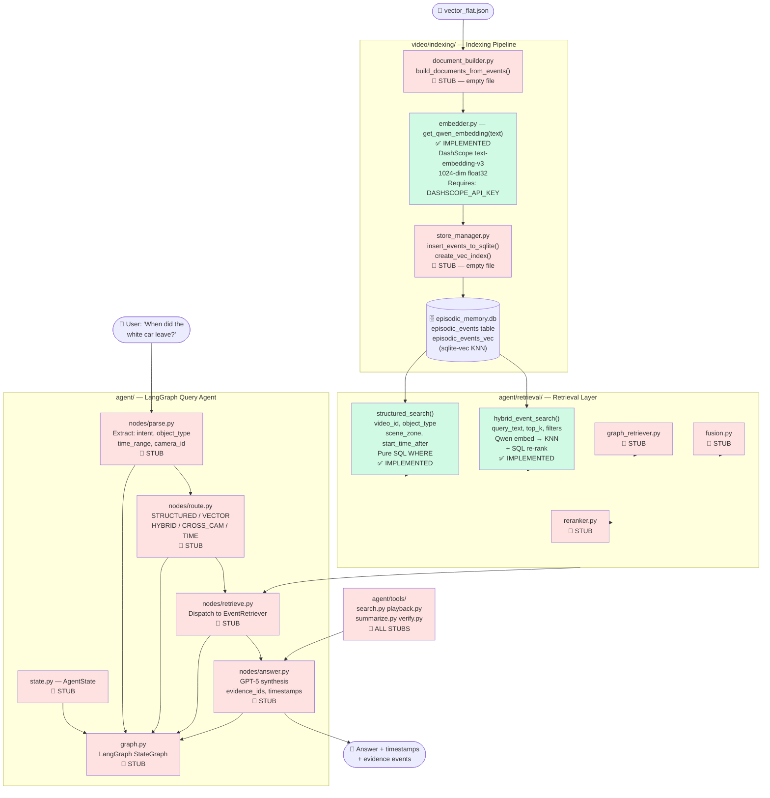
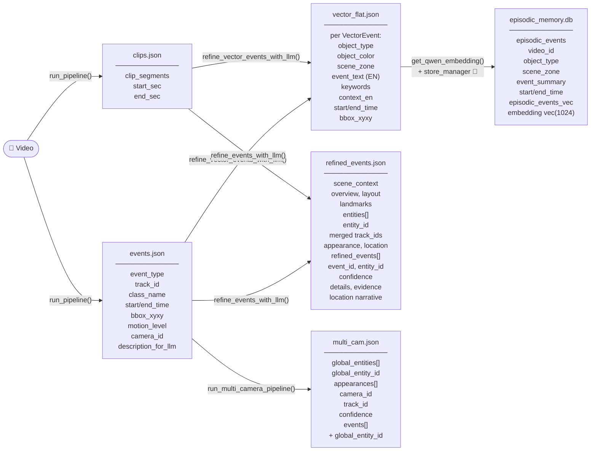

# CS32-1 Surveillance Video Query System — Pipeline Flowchart

> **Legend:** 🟢 Fully implemented  |  🟡 Partially implemented  |  🔴 Stub / Not yet implemented

---

## 1. Overall System Architecture

```mermaid
flowchart TD
    INPUT([🎥 Input: Video File\nMP4 / AVI / MOV])

    subgraph S1["⚙️ STAGE 1 — Visual Event Extraction 🟢"]
        direction TB
        DET["YOLO11m Detection\nconf=0.25, iou=0.45\nvision.py"]
        TRACK["BoT-SORT + ReID Tracking\nwith_reid=True\nbotsort_reid.yaml"]
        AGG["aggregate_tracks()\nPer-frame → Per-track records\nanalyzer.py"]
        SLICE["slice_events()\n5 event types classification\nanalyzer.py"]
        OUT1[("📄 events.json\n📄 clips.json")]
    end

    subgraph MULTICAM["🔀 OPTIONAL — Multi-Camera Extension 🟢"]
        direction TB
        REID["ReIDEmbedder\nOSNet x0_5 (512-dim)\n+ MobileNetV2 fallback\nreid_embedder.py"]
        STITCH["_stitch_same_camera_fragments()\ngap ≤ 3s AND cosine ≥ 0.80\nmulti_camera_coordinator.py"]
        MATCH["match_across_cameras()\n0.7×cosine + 0.3×time\ncross_camera_matcher.py"]
        VLM["verify_person_match_with_llm()\nGPT-5 vision for cosine ∈ [0.65, 0.80]\nevent_refinement_llm.py"]
        ENTITY["_build_global_entities()\nUnion-Find merge\ncross_camera_matcher.py"]
        OUT3[("📄 multi_cam.json\nGlobalEntity list")]
    end

    subgraph S2["🧠 STAGE 2 — LLM Refinement 🟢"]
        direction TB
        FRAMES["sample_frames_uniform()\nfps-based adaptive sampling\nframes.py"]
        HARD["build_entities_with_hard_constraints()\nHard rules + LLM YES/NO merge\nevent_refinement_llm.py"]
        LLM["refine_events_with_llm() [mode=full]\nOR\nrefine_vector_events_with_llm() [mode=vector]\nGPT-5 via LangChain + PydanticOutputParser\nevent_refinement_llm.py"]
        OUT2[("📄 refined_events.json [full]\nOR\n📄 vector_flat.json [vector]")]
    end

    subgraph S3["📦 STAGE 3 — Indexing 🟡"]
        direction TB
        DOCBUILD["document_builder.py\nBuild text docs from events\n🔴 stub"]
        EMBED["get_qwen_embedding()\nDashScope text-embedding-v3\n1024-dim float32\nembedder.py 🟢"]
        STORE["store_manager.py\nInsert to SQLite + sqlite-vec\n🔴 stub"]
        DB[("🗄️ episodic_memory.db\nepisodic_events table\nepisodic_events_vec table")]
    end

    subgraph S4["🤖 STAGE 4 — LangGraph Query Agent 🔴"]
        direction TB
        PARSE["nodes/parse.py\nExtract intent + entities\n🔴 stub"]
        ROUTE["nodes/route.py\nRoute: STRUCTURED / VECTOR / HYBRID\n🔴 stub"]
        RETRIEVE["nodes/retrieve.py\n→ EventRetriever\n🟡 partial"]
        ANSWER["nodes/answer.py\nGPT-5 answer synthesis\n🔴 stub"]
        OUT4(["💬 Natural Language Answer\n+ evidence_events + timestamps"])
    end

    subgraph RETRIEVAL["🔍 Retrieval Layer 🟡"]
        SR["structured_search()\nPure SQL filters\nevent_retriever.py 🟢"]
        HR["hybrid_event_search()\nQwen KNN + SQL re-rank\nevent_retriever.py 🟢"]
    end

    INPUT --> S1
    DET --> TRACK --> AGG --> SLICE --> OUT1
    OUT1 --> S2
    OUT1 --> MULTICAM
    REID --> STITCH --> MATCH
    MATCH --> VLM --> ENTITY --> OUT3
    OUT3 --> S2
    FRAMES --> HARD --> LLM --> OUT2
    OUT2 --> S3
    DOCBUILD --> EMBED --> STORE --> DB
    DB --> RETRIEVAL
    RETRIEVAL --> SR & HR --> RETRIEVE
    PARSE --> ROUTE --> RETRIEVE --> ANSWER --> OUT4

    USER([👤 User Query]) --> PARSE
```

---

## 2. Stage 1 — Detailed Detection & Tracking Flow

---

## 3. Stage 2 — LLM Refinement Flow

---

## 4. Multi-Camera Extension Flow

---

## 5. ReID Embedder Architecture

---

## 6. Stage 3+4 — Indexing & Agent (Current Status)

---

## 7. Data Schema Flow

---

## 8. Key Configuration Parameters

| Parameter           | Value                   | Location                    | Effect                      |
| ------------------- | ----------------------- | --------------------------- | --------------------------- |
| Detection model     | `yolo11m.pt`            | `vision.py resolve_model()` | Small object recall         |
| Detection conf      | `0.25`                  | `run_pipeline()` default    | Miss rate vs false positive |
| Detection iou       | `0.45`                  | `run_pipeline()` default    | NMS overlap threshold       |
| Tracker             | `botsort_reid`          | `run_pipeline()` default    | Appearance-based ReID       |
| `with_reid`         | `True`                  | `botsort_reid.yaml`         | Enable OSNet embeddings     |
| `track_buffer`      | `100`                   | `botsort_reid.yaml`         | Frames to keep lost tracks  |
| `appearance_thresh` | `0.25`                  | `botsort_reid.yaml`         | ReID match threshold        |
| `gmc_method`        | `sparseOptFlow`         | `botsort_reid.yaml`         | Camera motion compensation  |
| ReID primary        | OSNet x0_5 (512-dim)    | `reid_embedder.py`          | Person appearance features  |
| ReID fallback       | MobileNetV2 (1280-dim)  | `reid_embedder.py`          | Cross-platform safety       |
| Fragment stitch gap | `3.0s`                  | `default.yaml`              | Same-cam track merge        |
| Fragment stitch cos | `0.80`                  | `default.yaml`              | Same-cam cosine threshold   |
| Cross-cam max gap   | `30.0s`                 | `default.yaml`              | Time window for matching    |
| Cross-cam threshold | `0.65`                  | `default.yaml`              | Min match score             |
| Cross-cam scoring   | `0.7×cosine + 0.3×time` | `cross_camera_matcher.py`   | Combined score formula      |
| LLM verify range    | `[0.65, 0.80]`          | `default.yaml`              | Borderline VLM cases        |
| LLM verify top-k    | `3`                     | `default.yaml`              | Max VLM calls per run       |
| LLM model (refine)  | `gpt-5.4-mini`          | `refinement_runner.py`      | Event description           |
| LLM model (verify)  | `gpt-4o-mini` (default) | `event_refinement_llm.py`   | Person identity check       |
| Embedding model     | Qwen text-embedding-v3  | `embedder.py`               | 1024-dim vector index       |
| Motion window       | `1.5s`                  | `run_pipeline()`            | Sliding window for motion   |
| Motion threshold    | `20.0px`                | `run_pipeline()`            | Frame-diff sum threshold    |
| Entity merge gap    | `300s` (5 min)          | `RefineEventsConfig`        | Max gap for LLM merge       |
| Entity merge conf   | `0.75`                  | `RefineEventsConfig`        | Min LLM confidence          |
| Max time adjust     | `0.5s`                  | `RefineEventsConfig`        | LLM timestamp correction    |

